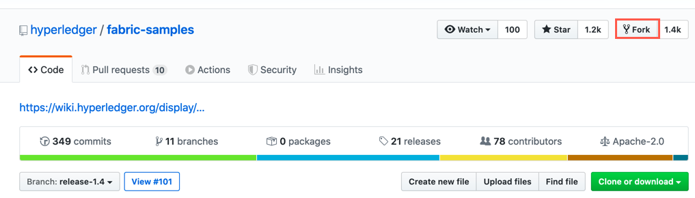
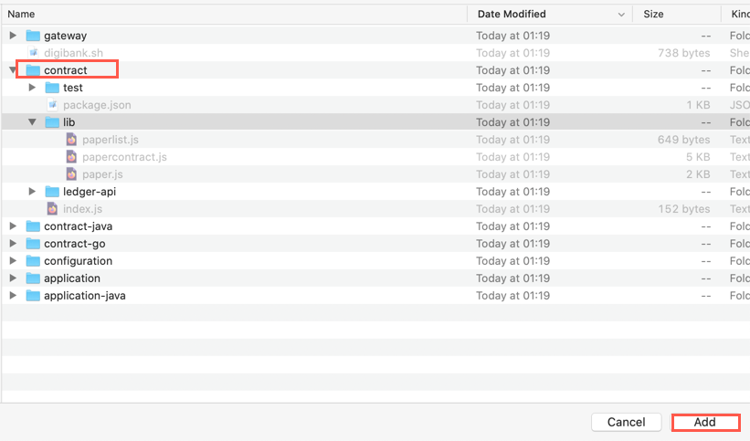
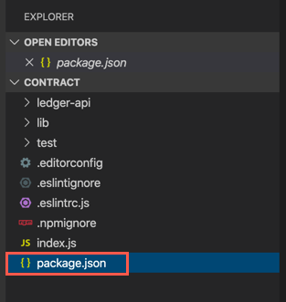
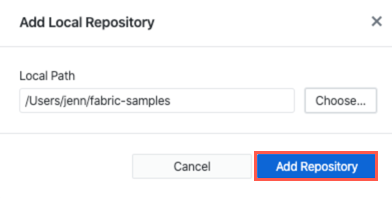
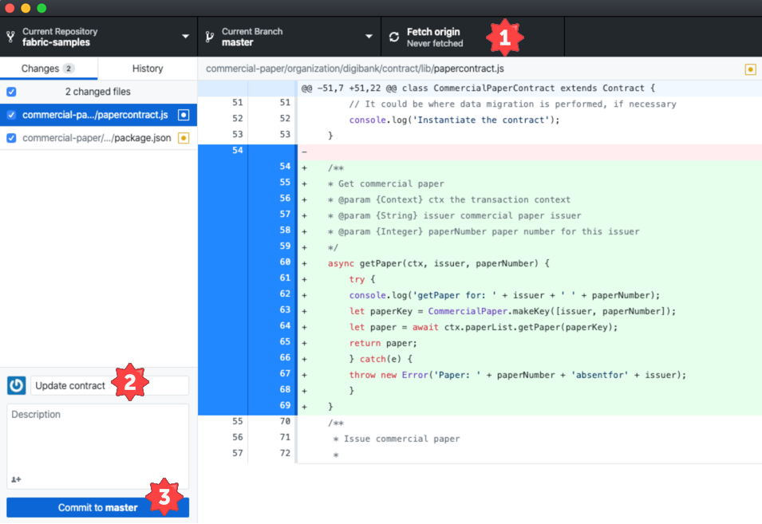
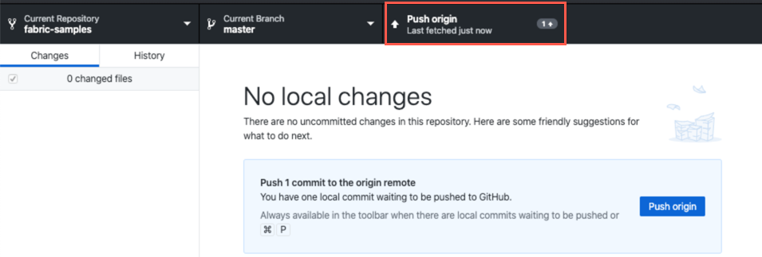

# Lab 2: Commercian Paper

This lab is a technical introduction to blockchain, specifically smart contract development using the latest developer enhancements in the Linux Foundation’s Hyperledger Fabric v1.4.

This lab is based on Hyperledger Fabric commercial paper tutorial, that can be found here:
https://hyperledger-fabric.readthedocs.io/en/latest/tutorial/commercial_paper.html


This lab will be broken down into the following parts:

* **Part** **I** -- focuses on using the command line on LinuxONE to get the basic-network up and running
* **Part II** -- use the command line to create a wallet for a user and install chaincode
* **Part III** --  use the command line to create a second wallet for a user
* **Part IV** -- work with chaincode in VSCode 

## Part I

In this lab, we will take you through connecting to an existing network, one that is running outside of Visual Studio Code (VS Code). The network we will be using is the ‘basic-network’ used by the “Commercial Paper” Hyperledger Fabric tutorial, and we will stand this network up, run through a simple version of the tutorial and then extend the network with a new smart contract transaction.

The scenario the tutorial follows is one of a commercial paper trading network called PaperNet. Commercial paper itself is a type of unsecured lending in the form of a “promissory note”. The papers are normally issued by large corporations to raise funds to meet short-term financial obligations at a fixed rate of interest. Once issued at a fixed price, for a fixed term, another company or bank will purchase them at a discount to the face value and when the term is up, they will be redeemed for their face value.
As an example, if a paper was issued at a face value of 10 million USD for a 6-month term at 2% interest then it could be bought for 9.8 million USD (10M – 2%) by another company or bank who are happy to bear the risk that the issuer will not default. Once the term is up, then the paper could be redeemed or sold back to the issuer for their full face value of 10 million USD. Between buying and redemption, the paper can be bought or sold between different parties on a commercial paper market.

These three key steps of issue, buy and redeem are the main transactions in a simplified commercial paper marketplace, which we will mirror in our lab. We will see a commercial paper issued by a company called MagnetoCorp, and once issued on the PaperNet blockchain network another company called DigiBank will first buy the paper and then redeem it.

In diagram form it looks like this:


### Steps 

1. Enter the following cd command to change directory to the basic network folder that we will use for this lab:
```
$ cd git/src/github.com/hyperledger/fabric-samples/basic-network/
```


2. Type the `ls` command and press enter to see the files that make up the basic- network.
```
$ ls
README.md  configtx.yaml    connection.yaml  crypto-config.yaml  generate.sh  start.sh  teardown.sh
config     connection.json  crypto-config    docker-compose.yml  init.sh      stop.sh
```

These files contain the configuration for the basic-network along with a script to set it up. Feel free to have a look at their contents if you are curious. The main files of interest are start.sh and docker-compose.yml; you can open the files to view them with a command like “code start.sh” but make sure you do not change the contents of any of the files.

3. To start the network running, run the following command in your terminal, `./start.sh`. 
```
$ ./start.sh

# don't rewrite paths for Windows Git Bash users
export MSYS_NO_PATHCONV=1

docker-compose -f docker-compose.yml down
Removing network net_basic
WARNING: Network net_basic not found.

docker-compose -f docker-compose.yml up -d ca.example.com orderer.example.com peer0.org1.example.com couchdb
Creating network "net_basic" with the default driver
Creating ca.example.com      ... done
Creating couchdb             ... done
Creating orderer.example.com ... done
Creating peer0.org1.example.com ... done
docker ps -a
CONTAINER ID        IMAGE                        COMMAND                  CREATED             STATUS                  PORTS                                            NAMES
31aafe485cbf        hyperledger/fabric-peer      "peer node start"        2 seconds ago       Up Less than a second   0.0.0.0:7051->7051/tcp, 0.0.0.0:7053->7053/tcp   peer0.org1.example.com
6fe8b6c8b567        hyperledger/fabric-couchdb   "tini -- /docker-ent…"   6 seconds ago       Up 1 second             4369/tcp, 9100/tcp, 0.0.0.0:5984->5984/tcp       couchdb
ce099d3ff248        hyperledger/fabric-ca        "sh -c 'fabric-ca-se…"   6 seconds ago       Up 3 seconds            0.0.0.0:7054->7054/tcp                           ca.example.com
e23fd6c6cedc        hyperledger/fabric-orderer   "orderer"                6 seconds ago       Up 1 second             0.0.0.0:7050->7050/tcp                           orderer.example.com

# wait for Hyperledger Fabric to start
# incase of errors when running later commands, issue export FABRIC_START_TIMEOUT=<larger number>
export FABRIC_START_TIMEOUT=10
#echo ${FABRIC_START_TIMEOUT}
sleep ${FABRIC_START_TIMEOUT}

# Create the channel
docker exec -e "CORE_PEER_LOCALMSPID=Org1MSP" -e "CORE_PEER_MSPCONFIGPATH=/etc/hyperledger/msp/users/Admin@org1.example.com/msp" peer0.org1.example.com peer channel create -o orderer.example.com:7050 -c mychannel -f /etc/hyperledger/configtx/channel.tx
2020-02-18 15:35:37.225 UTC [channelCmd] InitCmdFactory -> INFO 001 Endorser and orderer connections initialized
2020-02-18 15:35:37.248 UTC [cli.common] readBlock -> INFO 002 Received block: 0
# Join peer0.org1.example.com to the channel.
docker exec -e "CORE_PEER_LOCALMSPID=Org1MSP" -e "CORE_PEER_MSPCONFIGPATH=/etc/hyperledger/msp/users/Admin@org1.example.com/msp" peer0.org1.example.com peer channel join -b mychannel.block
2020-02-18 15:35:37.472 UTC [channelCmd] InitCmdFactory -> INFO 001 Endorser and orderer connections initialized
2020-02-18 15:35:37.575 UTC [channelCmd] executeJoin -> INFO 002 Successfully submitted proposal to join channel
```
Now let's take a look at the containers.

4. Run the command below in your terminal, `docker ps`.

```
$ docker ps
CONTAINER ID        IMAGE                              COMMAND                  CREATED             STATUS              PORTS                                            NAMES
f3e4a0c597fd        hyperledger/fabric-peer:1.4.1      "peer node start"        31 seconds ago      Up 29 seconds       0.0.0.0:7051->7051/tcp, 0.0.0.0:7053->7053/tcp   peer0.org1.example.com
b6e69ff6af06        hyperledger/fabric-orderer:1.4.1   "orderer"                34 seconds ago      Up 32 seconds       0.0.0.0:7050->7050/tcp                           orderer.example.com
30d71804d58d        hyperledger/fabric-ca:1.4.1        "sh -c 'fabric-ca-se…"   34 seconds ago      Up 33 seconds       0.0.0.0:7054->7054/tcp                           ca.example.com
8508faada7f5        hyperledger/fabric-couchdb         "tini -- /docker-ent…"   34 seconds ago      Up 31 seconds       4369/tcp, 9100/tcp, 0.0.0.0:5984->5984/tcp       couchdb

```

This command lists the docker containers that are running. Although this output is a little hard to read, you can make your terminal window wider to see the output better if you wish. 

This command shows that we have started four containers, one for each of the Hyperledger fabric-peer, fabric-ca, fabric-couchdb and fabric-orderer components.  Together these make up the simple basic-network that we will be using. A more realistic setup would have multiple copies of the components to better reflect the multiple parties in the network, but for a lab this simple network will suffice. 


5. These containers are joined together into the same docker network called net_basic. A docker network lets containers communicate with each other. Take a look at the network by running this command to inspect it: `docker network inspect net_basic`.

   

   You should see output similar to this:

   ```
   $ docker network inspect net_basic
   [
       {
           "Name": "net_basic",
           "Id": "a6e2e5d5baf8f110e6d6125bcc5a48cfe1a9cb9a46e22a8e22dcf80888e06271",
           "Created": "2020-02-18T17:35:21.559986348+02:00",
           "Scope": "local",
           "Driver": "bridge",
           "EnableIPv6": false,
           "IPAM": {
               "Driver": "default",
               "Options": null,
               "Config": [
                   {
                       "Subnet": "172.19.0.0/16",
                       "Gateway": "172.19.0.1"
                   }
               ]
           },
           "Internal": false,
           "Attachable": false,
           "Ingress": false,
           "ConfigFrom": {
               "Network": ""
           },
           "ConfigOnly": false,
           "Containers": {
               "31aafe485cbfabac9a77e4dbc78175f28fd79c3167280eb4b9ed328e791d9a18": {
                   "Name": "peer0.org1.example.com",
                   "EndpointID": "822bd34b3a6e34c8261817350cc442e32c083aa39f9160b6a2156592889d91a6",
                   "MacAddress": "02:42:ac:13:00:05",
                   "IPv4Address": "172.19.0.5/16",
                   "IPv6Address": ""
               },
               "6fe8b6c8b5675197a4fbca36c653a0f7bb3f9515a11bd87dda1ce635e0119455": {
                   "Name": "couchdb",
                   "EndpointID": "4ad9a8de2cc68672c2df0034d70e170228c4034fb44872cde317fd30d7a1a2b7",
                   "MacAddress": "02:42:ac:13:00:04",
                   "IPv4Address": "172.19.0.4/16",
                   "IPv6Address": ""
               },
               "ce099d3ff248a78b4de8f14843daf118cdffb506e734300449287faca6358385": {
                   "Name": "ca.example.com",
                   "EndpointID": "1deb52973049b54d3a58d3e5e81e99596d8ec4a655c8e60089bc11ec666899b8",
                   "MacAddress": "02:42:ac:13:00:02",
                   "IPv4Address": "172.19.0.2/16",
                   "IPv6Address": ""
               },
               "e23fd6c6cedcb6ef9c76793fafd4d2544bfab36938f16a2f84cfcd85323a4ca9": {
                   "Name": "orderer.example.com",
                   "EndpointID": "0bac6cca5463ace92d9ccd2ff94e97e88aa4e0ddcc44f4eca0d7886f665d7d14",
                   "MacAddress": "02:42:ac:13:00:03",
                   "IPv4Address": "172.19.0.3/16",
                   "IPv6Address": ""
               }
           },
           "Options": {},
           "Labels": {}
       }
   ]
   ```

   

Scroll back up and look at the output. You can see that each of the containers have their own IP address inside the same network so they can communicate with each other.


## Part II 

Next, we are going to act as a MagnetoCorp administrator again and interact with the network. To do this we need to issue commands to the peer to installandinstantiatesmart contracts (also known as chaincode). We are going to do this manually without VS Code for now so we can see the different experience


### Steps

1. Change directory to ~/git/src/github.com/hyperledger/fabric-samples/commercial-paper/organization/magnetocorp/configuration/cli/.

   `~/git/src/github.com/hyperledger/fabric-samples/commercial-paper/organization/magnetocorp/configuration/cli`

2. The Fabric commands we need to use are in the fabric-tools docker image, so let’s start it running by issuing this docker-compose command to start the container:
   `docker-compose -f docker-compose.yml up -d cliMagnetoCorp`


3. If we run the, `docker ps`, command again we should see that the new fabric-tools container is running. 

```
$ docker ps
CONTAINER ID        IMAGE                        COMMAND                  CREATED             STATUS              PORTS                                            NAMES
9631891b666c        hyperledger/fabric-tools     "/bin/bash"              49 seconds ago      Up 48 seconds                                                        cliMagnetoCorp
31aafe485cbf        hyperledger/fabric-peer      "peer node start"        25 minutes ago      Up 25 minutes       0.0.0.0:7051->7051/tcp, 0.0.0.0:7053->7053/tcp   peer0.org1.example.com
6fe8b6c8b567        hyperledger/fabric-couchdb   "tini -- /docker-ent…"   25 minutes ago      Up 25 minutes       4369/tcp, 9100/tcp, 0.0.0.0:5984->5984/tcp       couchdb
ce099d3ff248        hyperledger/fabric-ca        "sh -c 'fabric-ca-se…"   25 minutes ago      Up 25 minutes       0.0.0.0:7054->7054/tcp                           ca.example.com
e23fd6c6cedc        hyperledger/fabric-orderer   "orderer"                25 minutes ago      Up 25 minutes       0.0.0.0:7050->7050/tcp                           orderer.example.com
```


Next we will begin to deploy the PaperNet smart contract. Before we deploy the contract, we are going to create our own forked repository to work with later in this lab.

4. To work with the sample code, install Git to your laptop. [Install Git.](https://help.github.com/en/github/getting-started-with-github/set-up-git#setting-up-git)

* Install Git
* Setup your username in Git (if you don't have one already)
* Set your commit email address in Git (if you don't have one already)

5. It's also highly recommended that you install GitHub Desktop. This makes it easy to push changes from your machine to the GitHub repository. [Download and setup GitHub Desktop](https://help.github.com/en/desktop/getting-started-with-github-desktop/installing-github-desktop)

6. In a browser, go to the  [Hyperledger Fabric fabric-samples repository.](https://github.com/hyperledger/fabric-samples)

7. Select branch **release- 1.4** from the drop down menu. This will insure that we are working with the appropriate samples for our version of Hyperledger Fabric.


8. Select **Fork** to copy the repository to your own repository.



9. In your repository in the browser, select **Clone or download** and the **copy** button to get the URL to clone your repository to your laptop.
   

10. In a terminal on your laptop, navigate to a directory on your laptop where you would like to clone your repository to. Once you're there, enter the command `git clone -b release-1.4 https://github.com/xxxxxxxx/fabric-samples.git` where **https://github.com/xxxxxxxx/fabric-samples.git** is what you copied in the prior step.

11. Back in a terminal connected to your LinuxONE Community Cloud instance, change directory to fabric-samples. `cd ~/git/src/github.com/hyperledger/fabric-samples/`

12. We'll now change this cloned directory to work with our fork of fabric-samples. This will allow us to push changes to the sample code and pick it up on LinuxONE. In the terminal enter the command below:

`git remote add fork https://github.com/xxxxxxxxx/fabric-samples.git`, where  **https://github.com/xxxxxxxx/fabric-samples.git** is what you copied in the browser.

13. Let's make sure we have the latest version of the repository.

`git fetch fork`

14. Now we need to make sure that we will only be working with the branch release-1.4 of the repository as that correpsonds to our version of Hyperledger Fabric.

`git branch -u fork/release-1.4`

15. Change directory to the magnetocorp/contract folder:
    `cd ~/git/src/github.com/hyperledger/fabric-samples/commercial-paper/organization/magnetocorp/contract/`

16. Let's take a look at the smart contract papercontract.js code, you can do it either from a terminal (`cat -n lib/papercontract.js`) or from the browser, follow the link:
    https://github.com/hyperledger/fabric-samples/blob/release-1.4/commercial-paper/organization/magnetocorp/contract/lib/papercontract.js

17. Let’s expand the issue transaction and take a look so we can see what it will do.

* **Line 68** --  creates a new CommercialPaper object from the parameters passed in using the static createInstance method on the CommercialPaper class. This class is defined in the separate “paper.js” file which is also if the lib folder alongside papercontract.js if you want to take a look at this method.
* **Line 71** -- moves the newly created paper into the ISSUED state and on line 74 it has its owner set from the parameters passed in.
* **Line 77** --  adds the paper to a “paperList” which is responsible for storing the state of the paper in the world state. This is defined in the paperlist.js file if you want to take a deeper look.
* **Line 80** -- then returns the paper to the client who called this transaction.


18. Now we are going to install the papercontract onto a peer in the network. In your terminal window issue the following command:

```
docker exec cliMagnetoCorp peer chaincode install -n papercontract -v 0.0.3 -p /opt/gopath/src/github.com/contract -l node
```

<u>Note:</u> The above command must be entered as a single line. Be sure to copy /paste and enter it as a single line.

<u>Note 2:</u> In the above command, the flags are case-sensitive and the flag “-l” is a letter “l” for language and not a number one.

The output should be something like this one:

```
$ docker exec cliMagnetoCorp peer chaincode install -n papercontract -v 0.0.3 -p /opt/gopath/src/github.com/contract -l node
2020-02-18 16:07:42.117 UTC [chaincodeCmd] checkChaincodeCmdParams -> INFO 001 Using default escc
2020-02-18 16:07:42.117 UTC [chaincodeCmd] checkChaincodeCmdParams -> INFO 002 Using default vscc
2020-02-18 16:07:42.159 UTC [chaincodeCmd] install -> INFO 003 Installed remotely response:<status:200 payload:"OK" >
```


This command uses the cliMagnetoCorp container which was configured to send commands to peer0.org1.example.com in our basic network. Its main role is to copy the papercontract source code and send it to the remote peer, ready for it to be instantiated.


19. To instantiate the contract on peer0, issue the following command:

```
docker exec cliMagnetoCorp peer chaincode instantiate -n papercontract -v 0.0.3 -l node -c '{"Args":["org.papernet.commercialpaper:instantiate"]}' -C mychannel -P "AND ('Org1MSP.member')"
```

<u>Note:</u> As before, the above command must be entered as a single line. If you copy and paste it from here, be sure to enter it as a single line. 
<u>Note 2:</u> remember, the flags are case-sensitive and the flag “-l” is a letter “l” for language and not a number one.

20. When the command line returns, enter `docker ps`. You should see the new container, **dev-peer0.org1.example.com-papercontract-0** with the chaincode.

```
$ docker ps
CONTAINER ID        IMAGE                                                                                                             COMMAND                  CREATED              STATUS              PORTS                                            NAMES
ca3fb2377da2        dev-peer0.org1.example.com-papercontract-0.0.3-5f1d60e28249e81faa02102ce57e28b86443fdc9c08e350371a8b90ac690ae6e   "/bin/sh -c 'cd /usr…"   About a minute ago   Up About a minute                                                    dev-peer0.org1.example.com-papercontract-0.0.3
9631891b666c        hyperledger/fabric-tools                                                                                          "/bin/bash"              12 minutes ago       Up 12 minutes                                                        cliMagnetoCorp
31aafe485cbf        hyperledger/fabric-peer                                                                                           "peer node start"        37 minutes ago       Up 37 minutes       0.0.0.0:7051->7051/tcp, 0.0.0.0:7053->7053/tcp   peer0.org1.example.com
6fe8b6c8b567        hyperledger/fabric-couchdb                                                                                        "tini -- /docker-ent…"   37 minutes ago       Up 37 minutes       4369/tcp, 9100/tcp, 0.0.0.0:5984->5984/tcp       couchdb
ce099d3ff248        hyperledger/fabric-ca                                                                                             "sh -c 'fabric-ca-se…"   37 minutes ago       Up 37 minutes       0.0.0.0:7054->7054/tcp                           ca.example.com
e23fd6c6cedc        hyperledger/fabric-orderer                                                                                        "orderer"                37 minutes ago       Up 37 minutes       0.0.0.0:7050->7050/tcp                           orderer.example.com
```


This command also uses the cliMagnetoCorp container to cause the contract to become instantiated on the mychannel channel. In addition, it also invokes the instantiate transaction as part of the command which allows any required initialisation to take place. Finally, note the last option – the -P flag which specifies which organisations in the network need to endorse the transactions issued by this contract before they will be considered valid.

<u>Note</u>: this command may take a little time to run as it will cause the peer to create a new docker container to be created to run the contract in.


21. Now the contract is up and running, it is time to start running transactions, and to start things moving, MagnetoCorp is going to run an application to issue the first commercial paper on the PaperNet network. To do this we are going to act as Isabella, an employee of MagnetoCorp.

 

Change to the folder that contains the issue application. 

`cd ../application/`


22. Run the ls command to see the files in this folder: `ls`


We see that there are several files:

```
$ ls
addToWallet.js  issue.js  package-lock.json  package.json
```


Next let’s take a look at the issue application.

23. Take a look at the code for the issue application.

`cat -n issue.js`


The main points are:

* Lines 18 - 21: Import various dependencies

* Line 25: Load the identity from the wallet on the file system

* Line 31: Create a new gateway

* Line 41: Load the connection profile from file system

* Line 53: Connect to the gateway

* Line 58: Get the mychannel channel from the gateway network

* Line 63: Get the papercontract contract from the gateway

* Line 68: Use the contract to submit the issue transaction, passing in the details of the paper to be issued.

* Line 71: Log the response

  

  As we can see above on line 25, the issue application will need to load Isabella’s identity before it can create the transaction, so we need to make sure her identity is in the wallet that the issue application will use as shown in this diagram:

  


However, before we can run the application, we need to download the dependencies listed in the package.json file from npm

24. Switch back to terminal and issue this command:
    `npm install`

Note: This will take a while to download the dependencies and you may see a slightly different output to that shown below.

```
$ npm install

> pkcs11js@1.0.18 install /home/linux1/git/src/github.com/hyperledger/fabric-samples/commercial-paper/organization/magnetocorp/application/node_modules/pkcs11js
> node-gyp rebuild

make: Entering directory '/home/linux1/git/src/github.com/hyperledger/fabric-samples/commercial-paper/organization/magnetocorp/application/node_modules/pkcs11js/build'
  CXX(target) Release/obj.target/pkcs11/src/main.o
  CXX(target) Release/obj.target/pkcs11/src/dl.o
  CXX(target) Release/obj.target/pkcs11/src/const.o
  .
  .
  .
  . (output not shown)
  .
  .
  CXX(target) Release/obj.target/grpc_node/ext/byte_buffer.o
  CXX(target) Release/obj.target/grpc_node/ext/call.o
  CXX(target) Release/obj.target/grpc_node/ext/call_credentials.o
  CXX(target) Release/obj.target/grpc_node/ext/channel.o
  CXX(target) Release/obj.target/grpc_node/ext/channel_credentials.o
  CXX(target) Release/obj.target/grpc_node/ext/completion_queue.o
  CXX(target) Release/obj.target/grpc_node/ext/node_grpc.o
  CXX(target) Release/obj.target/grpc_node/ext/server.o
  CXX(target) Release/obj.target/grpc_node/ext/server_credentials.o
  CXX(target) Release/obj.target/grpc_node/ext/slice.o
  CXX(target) Release/obj.target/grpc_node/ext/timeval.o
  SOLINK_MODULE(target) Release/obj.target/grpc_node.node
  COPY Release/grpc_node.node
  COPY /home/linux1/git/src/github.com/hyperledger/fabric-samples/commercial-paper/organization/magnetocorp/application/node_modules/grpc/src/node/extension_binary/node-v57-linux-s390x-glibc/grpc_node.node
  TOUCH Release/obj.target/action_after_build.stamp
make: Leaving directory '/home/linux1/git/src/github.com/hyperledger/fabric-samples/commercial-paper/organization/magnetocorp/application/node_modules/grpc/build'
npm WARN nodejs@1.0.0 No description
npm WARN nodejs@1.0.0 No repository field.

added 323 packages in 90.961s
```


25. When the download has finished, if you run `ls` again, you will see a new node_modules folder has been created. It is the node_modules folder that contains the dependencies.

```
$ ls
addToWallet.js  issue.js  node_modules  package.json  package-lock.json
```


26. Now we are almost ready to issue a new commercial paper, we just need to load Isabella’s digital certificate into the wallet before we can use it.  To do this we run the following application:
    `node addToWallet.js`

<u>Note:</u> addToWallet.js simply copies an identity from the basic-network to our wallet location for use by other applications.

27. Run this command to see the contents of the newly created wallet:
    `ls -al ../identity/user/isabella/wallet/`

```
$ ls -al ../identity/user/isabella/wallet/
total 12
drwxr-xr-x 3 linux1 users 4096 Feb 18 20:03 .
drwxr-xr-x 3 linux1 users 4096 Feb 18 20:03 ..
drwxr-xr-x 2 linux1 users 4096 Feb 18 20:03 User1@org1.example.com
```


Now you can see the User1@org1.example.com folder which is used by the issue application. 

28. We can run another command to see the three files that make up the identity itself:
    `ls -al ../identity/user/isabella/wallet/User1@org1.example.com`

```
$ ls -al ../identity/user/isabella/wallet/User1@org1.example.com/
total 20
drwxr-xr-x 2 linux1 users 4096 Feb 18 20:03 .
drwxr-xr-x 3 linux1 users 4096 Feb 18 20:03 ..
-rw-r--r-- 1 linux1 users  246 Feb 18 20:03 c75bd6911aca808941c3557ee7c97e90f3952e379497dc55eb903f31b50abc83-priv
-rw-r--r-- 1 linux1 users  182 Feb 18 20:03 c75bd6911aca808941c3557ee7c97e90f3952e379497dc55eb903f31b50abc83-pub
-rw-r--r-- 1 linux1 users 1037 Feb 18 20:03 User1@org1.example.com
```


These files consist of a private key for signing transactions, a public key linked to the private key and a file that contains both metadata and a certificate for our user.

29. Now we can *finally* issue the commercial paper by running:

`node issue.js`

```
$ node issue.js
Connect to Fabric gateway.
Use network channel: mychannel.
Use org.papernet.commercialpaper smart contract.
Submit commercial paper issue transaction.
Process issue transaction response.{"class":"org.papernet.commercialpaper","key":"\"MagnetoCorp\":\"00001\"","currentState":1,"issuer":"MagnetoCorp","paperNumber":"00001","issueDateTime":"2020-05-31","maturityDateTime":"2020-11-30","faceValue":"5000000","owner":"MagnetoCorp"}
MagnetoCorp commercial paper : 00001 successfully issued for value 5000000
Transaction complete.
Disconnect from Fabric gateway.
Issue program complete
```


From the output you can see that we followed the steps outlined above to successfully issue commercial paper 00001 for 5,000,000 USD. We have submitted the transaction to the network and the contract has written these details to the world state and the ledger. 

The transaction was also endorsed and validated before it was committed.

## Part III 

We will now begin working in PaperNet as DigiBank.

Now that we have issued paper 00001, we want to take on the persona of an employee of DigiBank who is going to buy and redeem this paper. If we look at the diagram, we can see how they will interact with the same network:


### Steps

1. Let’s open up a new terminal window so we can act as Balaji, an employee
   of DigiBank. `ssh -i xxxxxxxxx linux1@xxx.xxx.xx.xx`


2. As DigiBank, let’s change to DigiBank’s application folder: 

`cd git/src/github.com/hyperledger/fabric-samples/commercial-paper/organization/digibank/application`


3. Let’s have a look at what files we have in this folder by running `ls`.

```
$ ls
addToWallet.js  buy.js  package-lock.json  package.json  redeem.js
```


4. As before, before we can run anything, we need to download the dependencies from npm:
   `npm install`

```
$ npm install

> pkcs11js@1.0.18 install /home/linux1/git/src/github.com/hyperledger/fabric-samples/commercial-paper/organization/digibank/application/node_modules/pkcs11js
> node-gyp rebuild

make: Entering directory '/home/linux1/git/src/github.com/hyperledger/fabric-samples/commercial-paper/organization/digibank/application/node_modules/pkcs11js/build'
  CXX(target) Release/obj.target/pkcs11/src/main.o
  CXX(target) Release/obj.target/pkcs11/src/dl.o
  .
  .
  . (output not shown)
  .
  CXX(target) Release/obj.target/grpc_node/ext/call.o
  CXX(target) Release/obj.target/grpc_node/ext/call_credentials.o
  CXX(target) Release/obj.target/grpc_node/ext/channel.o
  CXX(target) Release/obj.target/grpc_node/ext/channel_credentials.o
  CXX(target) Release/obj.target/grpc_node/ext/completion_queue.o
  CXX(target) Release/obj.target/grpc_node/ext/node_grpc.o
  CXX(target) Release/obj.target/grpc_node/ext/server.o
  CXX(target) Release/obj.target/grpc_node/ext/server_credentials.o
  CXX(target) Release/obj.target/grpc_node/ext/slice.o
  CXX(target) Release/obj.target/grpc_node/ext/timeval.o
  SOLINK_MODULE(target) Release/obj.target/grpc_node.node
  COPY Release/grpc_node.node
  COPY /home/linux1/git/src/github.com/hyperledger/fabric-samples/commercial-paper/organization/digibank/application/node_modules/grpc/src/node/extension_binary/node-v57-linux-s390x-glibc/grpc_node.node
  TOUCH Release/obj.target/action_after_build.stamp
make: Leaving directory '/home/linux1/git/src/github.com/hyperledger/fabric-samples/commercial-paper/organization/digibank/application/node_modules/grpc/build'
npm WARN nodejs@1.0.0 No description
npm WARN nodejs@1.0.0 No repository field.

added 323 packages in 85.012s
```

Note: remember this can take a while to complete.


5. As we are going to be running as Balaji, we need to load the identity they are going
   to use into DigiBank’s wallet, just like we did for Isabella earlier: 

   `node addToWallet.js`

6. Let’s take a quick look again at the identity the application copied: 
  `ls -al ../identity/user/balaji/wallet/`

```
$ ls -al ../identity/user/balaji/wallet/
total 12
drwxr-xr-x 3 linux1 users 4096 Feb 19 02:06 .
drwxr-xr-x 3 linux1 users 4096 Feb 19 02:06 ..
drwxr-xr-x 2 linux1 users 4096 Feb 19 02:06 Admin@org1.example.com
```

This time you can see the identity is Admin@org1.example.com, as Balaji is acting as an admin for DigiBank.


7. Just like last time, we can also run another command, we can see the three files that make up the identity itself:
   `ls -al  ../identity/user/balaji/wallet/Admin@org1.example.com`

```
$ ls -al  ../identity/user/balaji/wallet/Admin@org1.example.com
total 20
drwxr-xr-x 2 linux1 users 4096 Feb 19 02:06 .
drwxr-xr-x 3 linux1 users 4096 Feb 19 02:06 ..
-rw-r--r-- 1 linux1 users 1033 Feb 19 02:06 Admin@org1.example.com
-rw-r--r-- 1 linux1 users  246 Feb 19 02:06 cd96d5260ad4757551ed4a5a991e62130f8008a0bf996e4e4b84cd097a747fec-priv
-rw-r--r-- 1 linux1 users  182 Feb 19 02:06 cd96d5260ad4757551ed4a5a991e62130f8008a0bf996e4e4b84cd097a747fec-pub
```

Again, these files consist of a private key for signing transactions, a public key linked to the private key and a file that contains both metadata and a certificate for our user.

## Part IV

Now Balaji from DigiBank would like to buy the commercial paper 00001. However, he would like to take a look at this paper (00001) on the ledger before he submits the buytransaction.

1. To be able to query the ledger to look at the paper (00001), we will need to create a JavaScript file called getPaper.js. We will use VSCode to do this. Follow the directions in the link to download VSCode.

   [Download VSCode](https://code.visualstudio.com/download)

9. Open VSCode. From the "Welcome" screen, select **Open folder**.

   

10. In the file browser dialog, navigate to **.../fabric-samples/commercial-paper/organization/magentocorp/contract. Select **Add**.

   

11. Click **Don't save** on the pop-up prompt about making the folder a workspace.

    

12. Click on the **papercontract.js** file in the contract folder to open it for editing:

    

13. We are going to create a new transaction called **getPaper**. It is going to be a simple transaction that just returns the paper that was requested as a parameter. We are going to insert it between the existing **instantiate** and **issue** transactions starting on **line 54**.

Note: It is recommended that you copy in the code and paste at line 54 to avoid any typos.

```
/**
* Get commercial paper
* @param {Context} ctx the transaction context
* @param {String} issuer commercial paper issuer
* @param {Integer} paperNumber paper number for this issuer
*/
async getPaper(ctx, issuer, paperNumber) {
  try {
    console.log('getPaper for: ' + issuer + ' ' + paperNumber);
    let paperKey = CommercialPaper.makeKey([issuer, paperNumber]);
    let paper = await ctx.paperList.getPaper(paperKey);
    return paper;
  } catch(e) {
    throw new Error('Paper: ' + paperNumber + 'absentfor' + issuer);
  }
}
```


14. **Save** your code addition in VSCode. You can use CTRL + S (Windows/Linux), CMD + S (Mac) or go to File -> Save. 

15. In VSCode, click on **package.json**. We will edit the **version number** before pushing our changes to GitHub and installing on the network.

    

16. Change **Line 2** to say **papercontract** for the name, if needed, and increment the version to **0.0.4**. **Save** your changes.


17. Now that we've updated the contract for the chaincode, we're going to add a **getPaper.js** application that DigiBank can use from the terminal. To do this, go to ***File*** and ***Open***. Navigate to  **.../fabric-samples/commercial-paper/organization/digibank/application.** Select **Open**.

18. Select ***File*** and ***New file*** to create a new file in the application folder.

19. Copy and paste in the following code:

    ```
    /*
    SPDX-License-Identifier: Apache-2.0
    */
    /*
     * This application has 6 basic steps:
     * 1. Select an identity from a wallet
     * 2. Connect to network gateway
     * 3. Access PaperNet network
     * 4. Construct request to query a commercial paper
     * 5. Submit transaction
     * 6. Process response
     */
    'use strict';
    // Bring key classes into scope, most importantly Fabric SDK network class
    const fs = require('fs');
    const yaml = require('js-yaml');
    const { FileSystemWallet, Gateway } = require('fabric-network');
    const CommercialPaper = require('../contract/lib/paper.js');
    // A wallet stores a collection of identities for use
    const wallet = new FileSystemWallet('../identity/user/balaji/wallet');
    // Main program function
    async function main() {
        // A gateway defines the peers used to access Fabric networks
        const gateway = new Gateway();
    
        // Main try/catch block
        try {
            // Specify userName for network access
            // const userName = 'isabella.issuer@magnetocorp.com';
            const userName = 'Admin@org1.example.com';
            // Load connection profile; will be used to locate a gateway 
            let connectionProfile = yaml.safeLoad(fs.readFileSync('../gateway/networkConnection.yaml', 'utf8'));
            // Set connection options; identity and wallet
            let connectionOptions = {
                identity: userName,
                wallet: wallet,
                discovery: { enabled:false, asLocalhost: true }
            };
    
            // Connect to gateway using application specified parameters
            console.log('Connect to Fabric gateway.');
            await gateway.connect(connectionProfile, connectionOptions);
    
            // Access PaperNet network
            console.log('Use network channel: mychannel.');
            const network = await gateway.getNetwork('mychannel');
    
            // Get addressability to commercial paper contract
            console.log('Use org.papernet.commercialpaper smart contract.');
            const contract = await network.getContract('papercontract', 'org.papernet.commercialpaper');
    
            // get commercial paper
            console.log('Submit commercial paper getPaper transaction.');
            const getPaperResponse = await contract.evaluateTransaction('getPaper', 'MagnetoCorp', '00001');
    
            // process response
            console.log('Process getPaper transaction response.');
            let paperJSON = JSON.parse(getPaperResponse);
            let paper = CommercialPaper.createInstance(paperJSON.issuer, paperJSON.paperNumber, paperJSON.issueDateTime, paperJSON.maturityDateTime, paperJSON.faceValue);
            paper.setOwner(paperJSON.owner);
            paper.currentState = paperJSON.currentState;
    
            // let paper = CommercialPaper.fromBuffer(getPaperResponse);
            let paperState = 'Unknown';
            if(paper.isIssued()) {
                paperState = 'ISSUED';
            } else if(paper.isTrading()){
                paperState = 'TRADING';
            } else if(paper.isRedeemed()){
                paperState = 'REDEEMED';
            }
    
            console.log(` +--------- Paper Retrieved ---------+ `);
            console.log(` | Paper number: "${paper.paperNumber}"`);
            console.log(` | Paper is owned by: "${paper.owner}"`);
            console.log(` | Paper is currently: "${paperState}"`);
            console.log(` | Paper face value: "${paper.faceValue}"`);
            console.log(` | Paper is issued by: "${paper.issuer}"`);
            console.log(` | Paper issue on: "${paper.issueDateTime}"`);
            console.log(` | Paper matures on: "${paper.maturityDateTime}"`);
            console.log(` +-----------------------------------+ `);
            console.log('Transaction complete.');
    
            //console.log('Transaction complete.' + JSON.stringify(paper));
        } catch (error) {
            console.log(`Error processing transaction. ${error}`);
            console.log(error.stack);
        } finally {
            // Disconnect from the gateway
            console.log('Disconnect from Fabric gateway.')
            gateway.disconnect();
        }
    }
    main().then(() => {
        console.log('getPaper program complete.');
    }).catch((e) => {
        console.log('getPaper program exception.');
        console.log(e);
        console.log(e.stack);
        process.exit(-1);
    });
    ```

20. Go to ***File*** and ***Save as***. In the dialog, complete the following:

    * Save as: **getPaper.js**
    * Where: make sure you're in DigiBank's application folder
    * Format: **JavaScript**
    * **Save**

21. Open **GitHub Desktop**. Click ***File*** and ***Add local repository***. We are going to make GitHub Desktop aware of the fabric-samples repository we cloned and have been making changes in.

22. In the file browser window, navigate to where you cloned **fabric-samples** on your laptop and select **Open**.

23. Select **Add Repository**.

    

24. GitHub Desktop will have already detected the changes we've made. To push the changes to the repository, complete the following:

    * Select **Fetch origin**
    * Add a comment about the changes you've made.
    * Select **Commit to master**

    

25. After you've committed your changes, you'll see a new option to **Push origin**. Select it to send the changes to GitHub.

    

26. Now we'll need update the code on our LinuxONE guest where the fabric is running. In the terminal connected to LinuxONE:

    Change directory to fabric-samples. `cd ~/git/src/github.com/hyperledger/fabric-samples/`

27. We will run two commands to pick up our changes on LinuxONE.

    * `git fetch` which checks to see the latest code available

    * `git pull`which brings the changed code to LinuxONE

28. Now that we have the code on LinuxONE, use the following command to install the updated contract. 

```
$ docker exec cliMagnetoCorp peer chaincode install -n papercontract -v 0.0.4 -p /opt/gopath/src/github.com/contract -l node

2020-02-21 19:18:48.802 UTC [chaincodeCmd] checkChaincodeCmdParams -> INFO 001 Using default escc
2020-02-21 19:18:48.802 UTC [chaincodeCmd] checkChaincodeCmdParams -> INFO 002 Using default vscc
2020-02-21 19:18:48.814 UTC [chaincodeCmd] install -> INFO 003 Installed remotely response:<status:200 payload:"OK" >
```

29. Now we will instantiate it using the upgrade command. Use the command below to upgrade your contract.

    ```
    $ docker exec cliMagnetoCorp peer chaincode upgrade -o orderer.example.com:7050 -C mychannel -n papercontract -v 0.0.4 -p /opt/gopath/src/github.com/contract -l node -c '{"Args":["org.papernet.commercialpaper:instantiate"]}' -P "AND ('Org1MSP.member')"
    
    2020-02-21 19:19:01.074 UTC [chaincodeCmd] checkChaincodeCmdParams -> INFO 001 Using default escc
    2020-02-21 19:19:01.074 UTC [chaincodeCmd] checkChaincodeCmdParams -> INFO 002 Using default vscc
    ```

    

30. Check to see the new chaincode running, **docker ps -a**.


```
$ docker ps -a
3a20b17e078b        dev-peer0.org1.example.com-papercontract-0.0.4-417f4d6119f4e4741045f8101a3e8da03a17e96d568b2bd408cedb3b6f1258e5   "/bin/sh -c 'cd /usr…"   About a minute ago   Up About a minute                                                    dev-peer0.org1.example.com-papercontract-0.0.4
ca3fb2377da2        dev-peer0.org1.example.com-papercontract-0.0.3-5f1d60e28249e81faa02102ce57e28b86443fdc9c08e350371a8b90ac690ae6e   "/bin/sh -c 'cd /usr…"   2 days ago          Up 2 days                                                            dev-peer0.org1.example.com-papercontract-0.0.3
9631891b666c        hyperledger/fabric-tools                                                                                          "/bin/bash"              2 days ago          Up 2 days                                                            cliMagnetoCorp
31aafe485cbf        hyperledger/fabric-peer                                                                                           "peer node start"        2 days ago          Up 2 days           0.0.0.0:7051->7051/tcp, 0.0.0.0:7053->7053/tcp   peer0.org1.example.com
6fe8b6c8b567        hyperledger/fabric-couchdb                                                                                        "tini -- /docker-ent…"   2 days ago          Up 2 days           4369/tcp, 9100/tcp, 0.0.0.0:5984->5984/tcp       couchdb
ce099d3ff248        hyperledger/fabric-ca                                                                                             "sh -c 'fabric-ca-se…"   2 days ago          Up 2 days           0.0.0.0:7054->7054/tcp                           ca.example.com
e23fd6c6cedc        hyperledger/fabric-orderer                                                                                        "orderer"                2 days ago          Up 2 days           0.0.0.0:7050->7050/tcp                           orderer.example.com
```
31. Now that the chaincode is installed. We need to install the application for DigiBank to use. 
`cd ~/git/src/github.com/hyperledger/fabric-samples/commercial-paper/organization/digibank/application`

Now we'll need to install the updated code.
  
  `npm install`
  
    
```
$ cd ~/my-fabric-samples/commercial-paper/organization/digibank/application 
$ npm install
> pkcs11js@1.0.18 install /home/linux1/my-fabric-samples/commercial-paper/organization/digibank/application/node_modules/pkcs11js
> node-gyp rebuild

make: Entering directory '/home/linux1/my-fabric-samples/commercial-paper/organization/digibank/application/node_modules/pkcs11js/build'
  CXX(target) Release/obj.target/pkcs11/src/main.o
  CXX(target) Release/obj.target/pkcs11/src/dl.o
  .
  .
  . (output not shown)
  .
  CXX(target) Release/obj.target/grpc_node/ext/server_credentials.o
  CXX(target) Release/obj.target/grpc_node/ext/slice.o
  CXX(target) Release/obj.target/grpc_node/ext/timeval.o
  SOLINK_MODULE(target) Release/obj.target/grpc_node.node
  COPY Release/grpc_node.node
  COPY /home/linux1/my-fabric-samples/commercial-paper/organization/digibank/application/node_modules/grpc/src/node/extension_binary/node-v57-linux-s390x-glibc/grpc_node.node
  TOUCH Release/obj.target/action_after_build.stamp
make: Leaving directory '/home/linux1/my-fabric-samples/commercial-paper/organization/digibank/application/node_modules/grpc/build'
npm WARN nodejs@1.0.0 No description
npm WARN nodejs@1.0.0 No repository field.

added 323 packages in 84.427s

```

32. Now that we've updated the code, we need to re-add **Balaji's** credentials. Run the following command:
    
    `node addToWallet.js`
    
33. In the same  terminal, run the new application. This allows **Balaji** from **DigiBank** to see the commercial paper to decide if he wants it before buying it.
    `node getPaper.js`

    ```
    $ node getPaper.js
    Connect to Fabric gateway.
    Use network channel: mychannel.
    Use org.papernet.commercialpaper smart contract.
    Submit commercial paper getPaper transaction.
    Process getPaper transaction response.
     +--------- Paper Retrieved ---------+
     | Paper number: "00001"
     | Paper is owned by: "MagnetoCorp"
     | Paper is currently: "ISSUED"
     | Paper face value: "5000000"
     | Paper is issued by: "MagnetoCorp"
     | Paper issue on: "2020-05-31"
     | Paper matures on: "2020-11-30"
     +-----------------------------------+
    Transaction complete.
    Disconnect from Fabric gateway.
    getPaper program complete.
    ```

34. We can see that the paper **00001** was successfully retrieved and that its state is currently **ISSUED**. **Balaji** is now ready to buy the paper.

To buy the paper, run the command `nody buy.js`
```    
$ node buy.js 
Connect to Fabric gateway.
Use network channel: mychannel.
Use org.papernet.commercialpaper smart contract.
Submit commercial paper buy transaction.
Process buy transaction response.
MagnetoCorp commercial paper : 00001 successfully purchased by DigiBank
Transaction complete.
Disconnect from Fabric gateway.
Buy program complete.
```
As you can see the transaction went through successfully, and paper 0001 is now owned by DigiBank.

34. Next, let’s assume that the maturity date has been reached and DigiBank wants to redeem the paper. In the same terminal, let’s run the redeem application as Balaji:
    `node redeem.js`

```
$ node redeem.js 
Connect to Fabric gateway.
Use network channel: mychannel.
Use org.papernet.commercialpaper smart contract.
Submit commercial paper redeem transaction.
Process redeem transaction response.
MagnetoCorp commercial paper : 00001 successfully redeemed with MagnetoCorp
Transaction complete.
Disconnect from Fabric gateway.
Redeem program complete.
```
Again the transaction has run smoothly, and the paper was redeemed with MagnetoCorp.

**End of the lab**

### Summary

In this lab, you have completed the following:

*  Edited application code and contracts with VSCode and used GitHub to move it to your LinuxONE Server
* Created wallets for two individuals at two different companies
* Started up a basic-network that is required for the commercial-paper example


© 2020 International Business Machines Corporation. No part of this document may be reproduced or transmitted in any form without written permission from IBM.
